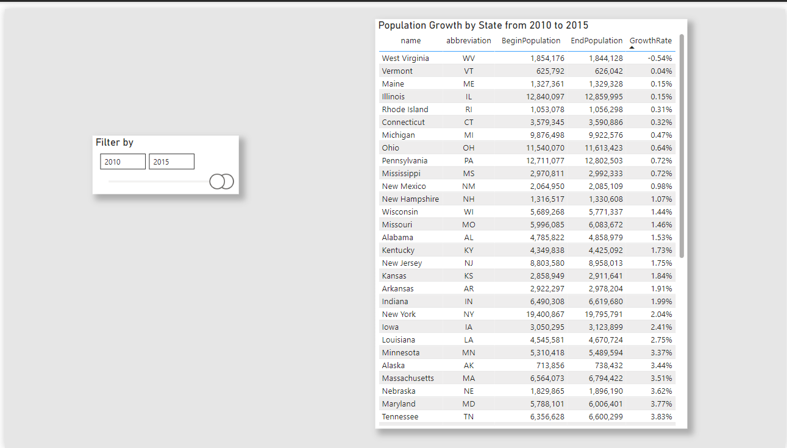

# 📊 US States Power BI Dashboard

This Power BI dashboard explores demographic data across US states, with breakdowns by region and time.

## 🧩 Features

- **Interactive Map**: View population distributions by Census Region.
- **Table View**: Drill down into individual state data including abbreviations, regions, and 2015 population.
- **Growth Analysis**: Compare population growth by state between 2010–2015.
- **Dynamic Tooltip**: Hover over a state (e.g., Kansas) to view population trends from 1950 to 2015.
- **Slicers**: Filter by region or by year.

## 📁 Files Included

- `us_states_dashboard.pbix`: Main Power BI file (open with Power BI Desktop).
- `screenshots/`: Visual previews of dashboard states.

## 📌 Skills Demonstrated

- Data Modeling
- DAX Calculations
- Map Visualizations
- Custom Tooltips
- Interactive Slicers

## 📸 Additional Views

**Growth Rate Page**  

**Filtered View (South Region)**  

**Custom Tooltip - Kansas**  

---

## 👨‍💻 How to Open

To view the report:
1. Install [Power BI Desktop](https://powerbi.microsoft.com/desktop/)
2. Clone or download this repo
3. Open `us_states_dashboard.pbix`

---

## 🗃️ Data Source

- Sample dataset from Power BI tutorials / US Census Bureau (example data only)